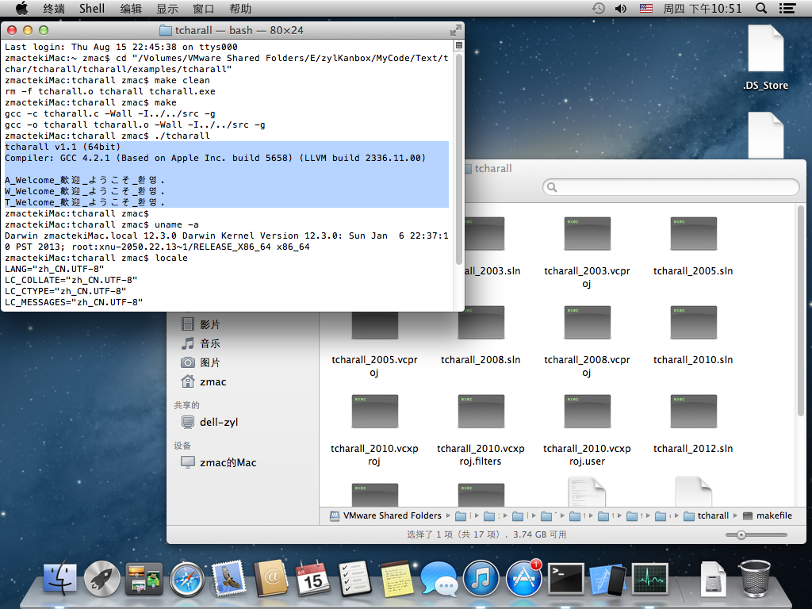

tcharall
========

* Git:	https://github.com/zyl910/tcharall
* Blog:	http://www.cnblogs.com/zyl910/tag/tcharall/

tcharall is a lightweight C library.

Features (特性):
* TCHAR on all platforms (让所有平台支持TCHAR类型) . e.g. linux, mac .
* Macros for char types format specifiers (字符类型的格式控制宏). e.g. `PRIsA`, `PRIsW`, `PRIsT` .
* Support `_tmain` (支持 `_tmain` 入口函数).

## Usage (用法)

Add `src/*.*` to you project (将 `src/*.*` 加入到您的项目).

Example code:

```c
#include <stdio.h>
#include <locale.h>
#include <wchar.h>

#include "auto_tchar.h"
#include "prichar.h"
#include "auto_tmain.h"


const char* psa = "A_Welcome_歡迎_ようこそ_환영.";	//!< Narrow char string. "Welcome": English, Traditional Chinese, Japanese, Korean.
const wchar_t* psw = L"W_Welcome_歡迎_ようこそ_환영.";	//!< Wide char string.
const TCHAR* pst = _T("T_Welcome_歡迎_ようこそ_환영.");	//!< TCHAR string.

/// tchar main .
int _tmain(int argc, TCHAR* argv[])
{
	// init.
	setlocale(LC_ALL, "");	// 使用客户环境的缺省locale.

	// title.
	_tprintf(_T("tcharall v1.1 (%dbit)\n"), (int)(8*sizeof(int*)));
	_tprintf(_T("\n"));

	// show.
	_tprintf(_T("%")_T(PRIsA)_T("\n"), psa);	// Print narrow char string.
	_tprintf(_T("%")_T(PRIsW)_T("\n"), psw);	// Print wide char string.
	_tprintf(_T("%")_T(PRIsT)_T("\n"), pst);	// Print TCHAR string.
	

	return 0;
}
```




## Documentation (文档)

You can generate documentation with [doxygen](http://www.stack.nl/~dimitri/doxygen/index.html) (您可以用doxygen生成文档).

Use doxywizard to open *.doxygen file (使用doxywizard打开 *.doxygen).

* tcharall_doc.doxygen: Generates documentation from interface files (生成接口的文档) .
* tcharall_docfull.doxygen: Generates documentation from interface & implement and example files (生成接口、实现、示例等内容的详细文档).

You may need change INCLUDE_PATH in *.doxyfile with the actual location (您可能需要在 *.doxygen 中调整INCLUDE_PATH为实际路径).


## MIT License (MIT许可证)

Copyright (c) 2000-2013 zyl910 \<zyl910hero@gmail.com\>

Permission is hereby granted, free of charge, to any person obtaining a copy
of this software and associated documentation files (the "Software"), to deal
in the Software without restriction, including without limitation the rights
to use, copy, modify, merge, publish, distribute, sublicense, and/or sell
copies of the Software, and to permit persons to whom the Software is
furnished to do so, subject to the following conditions:

The above copyright notice and this permission notice shall be included in
all copies or substantial portions of the Software.

THE SOFTWARE IS PROVIDED "AS IS", WITHOUT WARRANTY OF ANY KIND, EXPRESS OR
IMPLIED, INCLUDING BUT NOT LIMITED TO THE WARRANTIES OF MERCHANTABILITY,
FITNESS FOR A PARTICULAR PURPOSE AND NONINFRINGEMENT. IN NO EVENT SHALL THE
AUTHORS OR COPYRIGHT HOLDERS BE LIABLE FOR ANY CLAIM, DAMAGES OR OTHER
LIABILITY, WHETHER IN AN ACTION OF CONTRACT, TORT OR OTHERWISE, ARISING FROM,
OUT OF OR IN CONNECTION WITH THE SOFTWARE OR THE USE OR OTHER DEALINGS IN
THE SOFTWARE.

## Tested compiler (测试过的编译器)

* Virtual C++: 6, 7.1(2003), 8(2005), 9(2008), 10(2010), 11(2012).
* Borland C++ Builder: 6.
* GCC(Linux): 4.7.0(Fedora 17),  4.7.2(Fedora 18),  4.8.1(Fedora 19).
* GCC(MinGW): 4.6.2(MinGW(20120426)), 4.7.1(TDM-GCC(MinGW-w64)).
* LLVM GCC: 4.2(Mac OS X Lion 10.7.4), 4.2.1(Mac OS X Mountain Lion 10.8.3).


## Change history (变更日志)

[2013-08-16] v1.1: http://www.cnblogs.com/zyl910/p/tcharall_v101.html

* Upload the source code to [github](https://github.com/zyl910/tcharall) (将源码上传到github).
* Change the directory structure (调整目录结构).
* Add CMake file (添加CMake编译配置文件).
* Using Doxygen style comments (使用doxygen规范注释).

[2013-01-17] v1.0: http://www.cnblogs.com/zyl910/archive/2013/01/17/tcharall.html

* Release v1.0 (发布1.0版).
* Rename to `auto_tchar.h` (为了避免包含目录问题，更名`auto_tchar.h`（`原tchar.h`）).
* Fix BCB6 `TCHAR` undefined bug (修正BCB6的TCHAR问题. `tchar.h`中没有定义`TCHAR`，只定义了`_TCHAR`. `TCHAR`是在`winnt.h`中定义的) .

[2012-11-08] v0.1
* Complete the v0.1 version (初步完成v0.1版).
